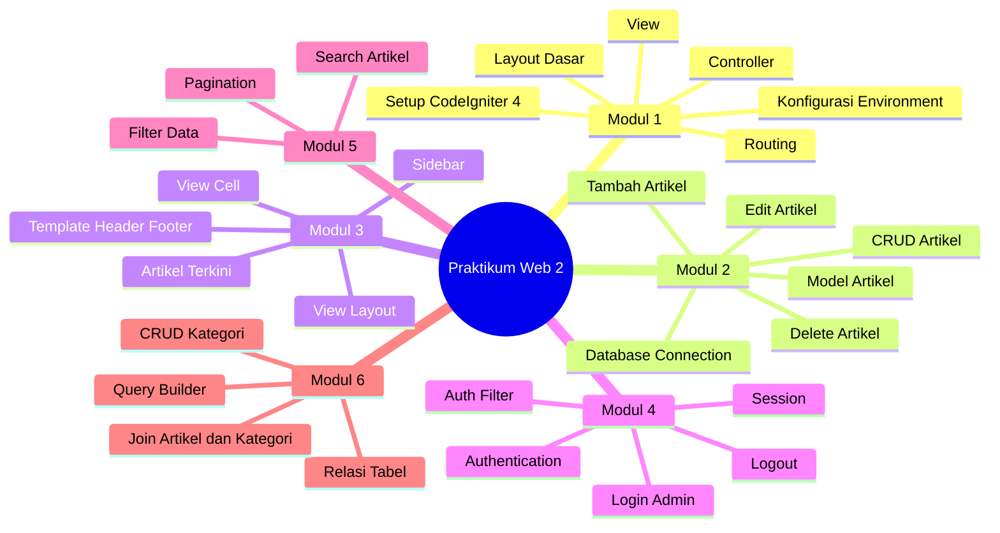
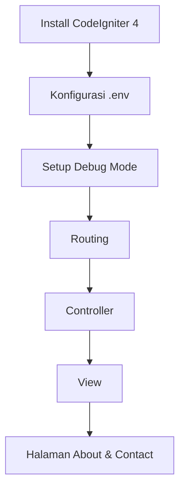
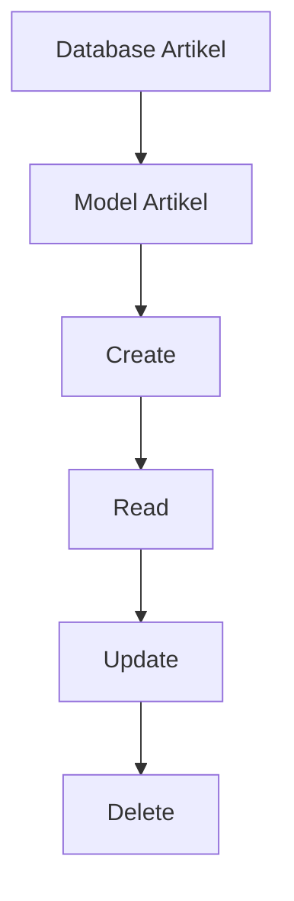
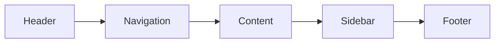
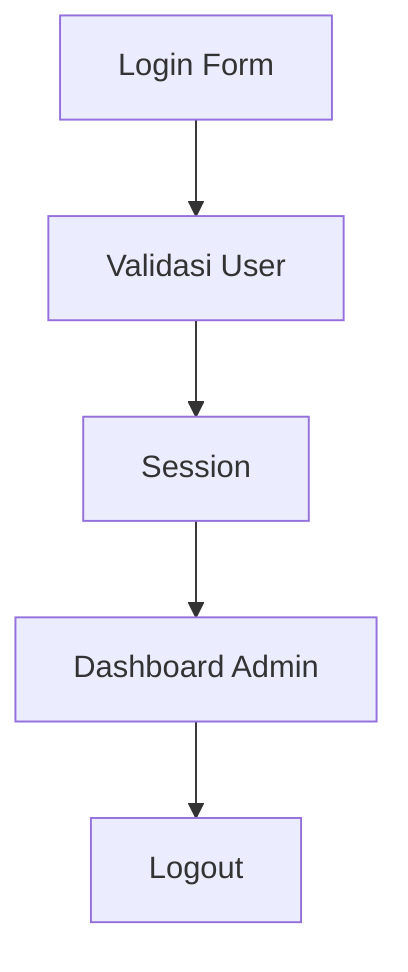
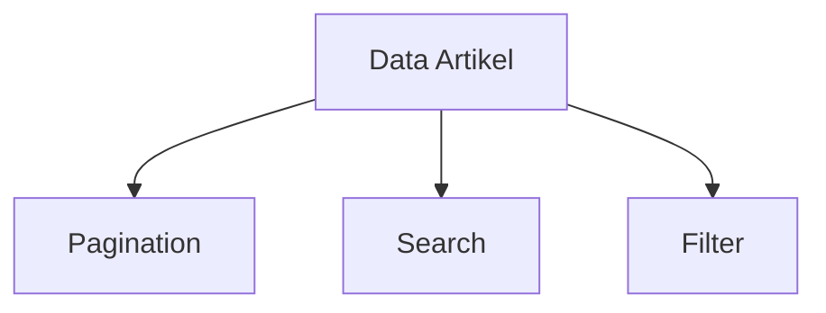
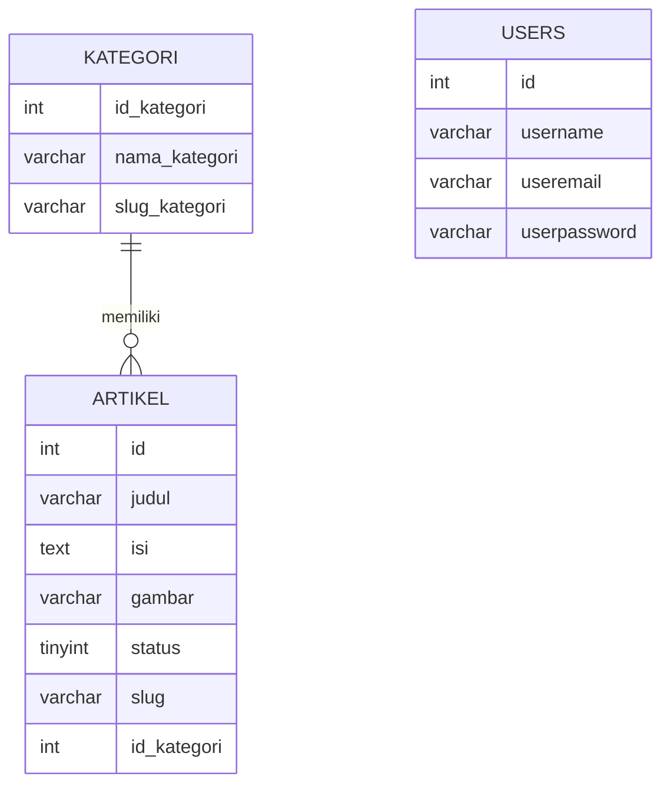
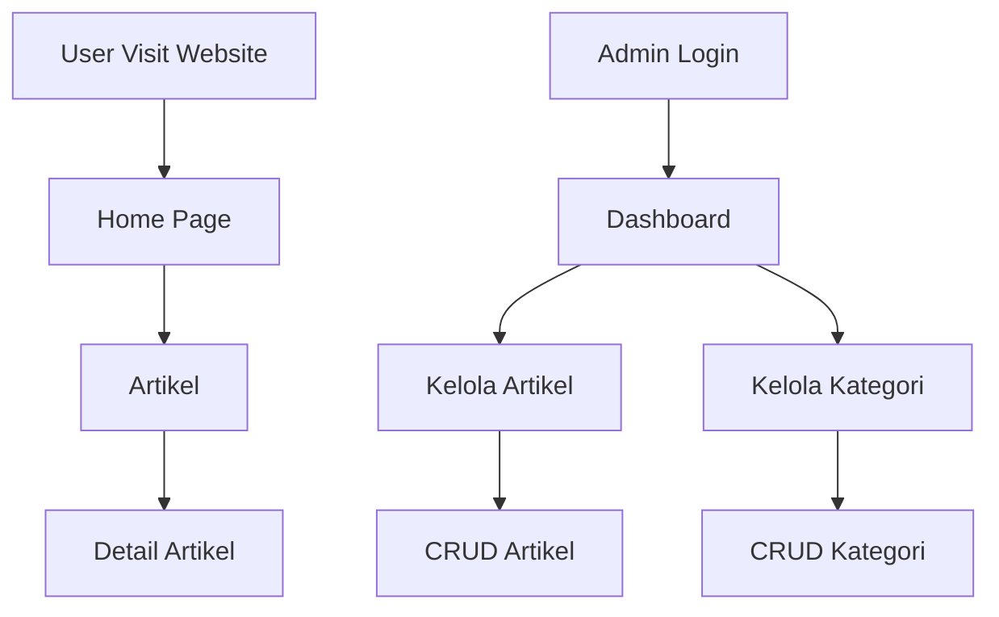
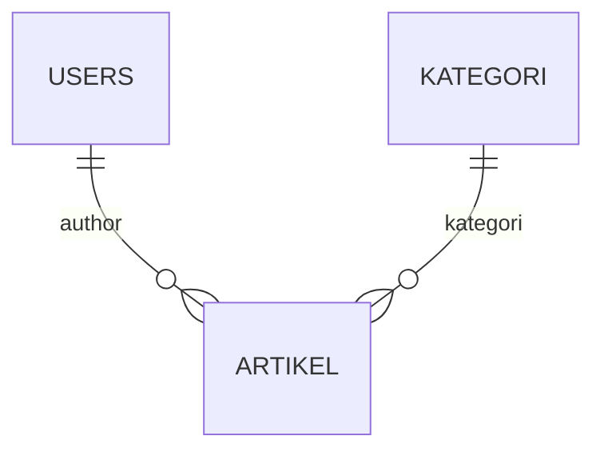
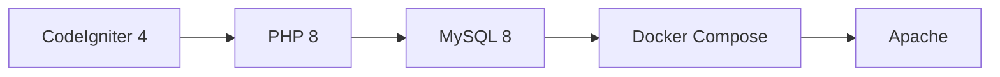

# Praktikum Web 2 - CodeIgniter 4 dengan Docker Compose

---

## Modul 1 — PHP Framework (CodeIgniter 4)

### Implementasi:
- Instalasi CodeIgniter 4
- Konfigurasi `.env`
- Routing dasar
- Pembuatan controller
- Pembuatan halaman statis

### Screenshot:

---

## Modul 2 — Framework Lanjutan (CRUD)

### Implementasi:
- CRUD Artikel
- Validasi input
- Auto generate slug
- Upload gambar artikel

### Screenshot:

---

## Modul 3 — View Layout dan View Cell

### Implementasi:
- Template layout reusable
- Header & Footer terpisah
- Sidebar dinamis
- View Cell artikel terbaru

### Screenshot:

---

## Modul 4 — Framework Lanjutan (Login)

### Implementasi:
- Login admin
- Session authentication
- Middleware Auth Filter
- Logout system

### Screenshot:

---

## Modul 5 — Pagination dan Pencarian

### Implementasi:
- Pagination artikel publik
- Pagination admin
- Search berdasarkan judul
- Search isi artikel
- Filter kategori

### Screenshot:

---

## Modul 6 — Relasi Tabel dan Query Builder

### Implementasi:
- Relasi One-to-Many
- Artikel ↔ Kategori
- Query Builder Join
- CRUD kategori
- Validasi delete kategori

### Screenshot:

---

## Workflow Aplikasi

---

## Struktur Database

---

## Teknologi

