# Praktikum Web 2 - CodeIgniter 4 dengan Docker Compose

## Nama  : Danur Wenda Prasetiyo  
## Kelas : I241A  
## NIM   : 312410008  

Website portal artikel sederhana berbasis **CodeIgniter 4** yang dikembangkan secara bertahap berdasarkan Praktikum Pemrograman Web 2 (Modul 1–6).  
Project ini mencakup implementasi **routing**, **CRUD**, **template layout**, **autentikasi**, **pagination**, **pencarian**, **filter**, **relasi database**, dan **containerization menggunakan Docker Compose**.

---

# 📚 Daftar Modul Praktikum

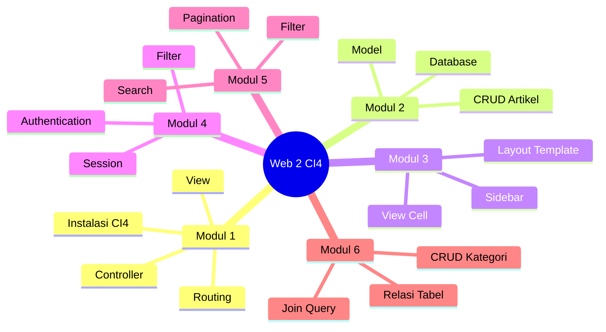

---

# 🛠 Teknologi yang Digunakan

| Komponen | Teknologi |
|--|--|
| Framework | CodeIgniter 4 |
| Backend | PHP 8.x |
| Database | MySQL 8 |
| Web Server | Apache |
| Container | Docker |
| Orchestration | Docker Compose |
| Dependency Manager | Composer |

---

# 📦 Instalasi & Setup

## Prasyarat

Pastikan sudah terinstall:

- Docker
- Docker Compose
- Git

Cek versi:

```bash
docker --version
docker compose version
git --version
```

---

## Clone Repository

```bash
git clone https://github.com/dnrprsty/Web2_Praktikum.git
cd Web2_Praktikum
```

---

## Build Container

Build semua container:

```bash
docker compose up --build -d
```

Flow Docker:

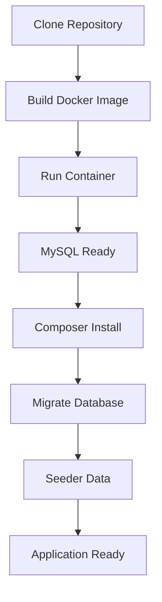

---

## Cek Container

```bash
docker compose ps
```

---

## Melihat Log

```bash
docker compose logs -f app
```

---

## Akses Aplikasi

Web:

```text
http://localhost:8082
```

Database:

```text
localhost:3307
```

---

## Stop Container

```bash
docker compose down
```

---

## Rebuild Ulang

Jika ada perubahan Dockerfile:

```bash
docker compose up --build -d
```

---

# 👤 Akun Default

Seeder otomatis membuat akun admin:

Email:

```text
admin@email.com
```

Password:

```text
admin123
```

Login:

```text
http://localhost:8082/user/login
```

---

# 📘 Modul 1 — Pengenalan Framework CodeIgniter 4

Modul pertama berfokus pada instalasi framework dan memahami konsep MVC.

## Materi:
- Instalasi CodeIgniter 4
- Konfigurasi `.env`
- Routing
- Controller
- View
- Halaman statis

Flow:

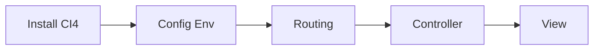

Implementasi:
- Home Controller
- Page Controller
- About Page
- Contact Page

Screenshot:

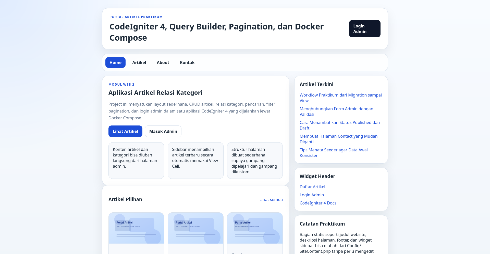

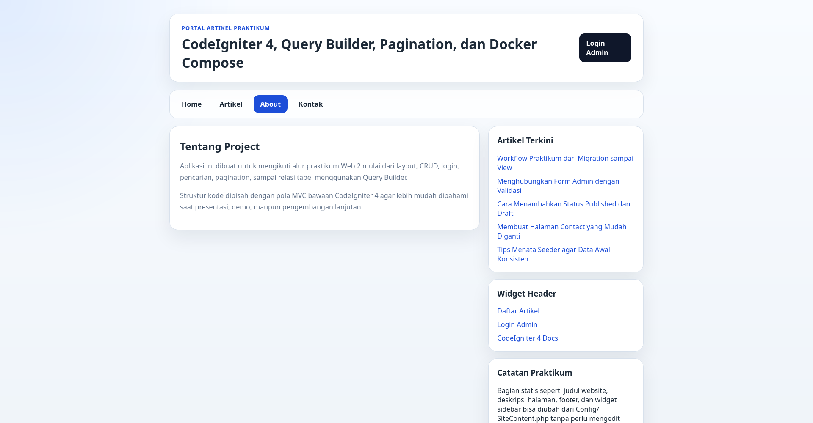

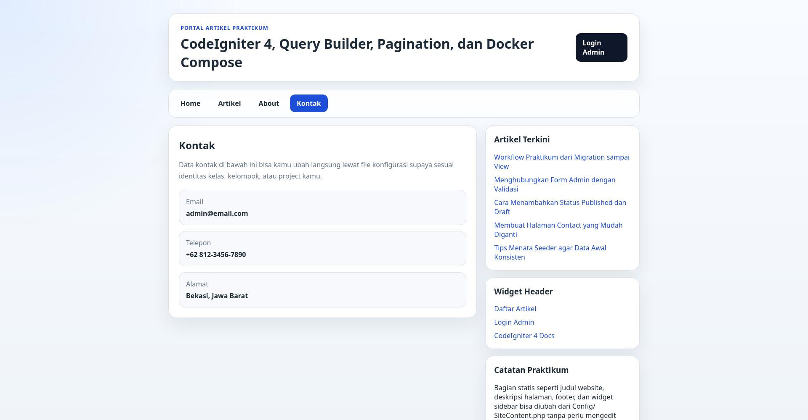

---

# 📘 Modul 2 — CRUD Artikel

Modul kedua berfokus pada operasi CRUD menggunakan database.

Materi:
- Database connection
- Model Artikel
- Insert data
- Update data
- Delete data

Flow:

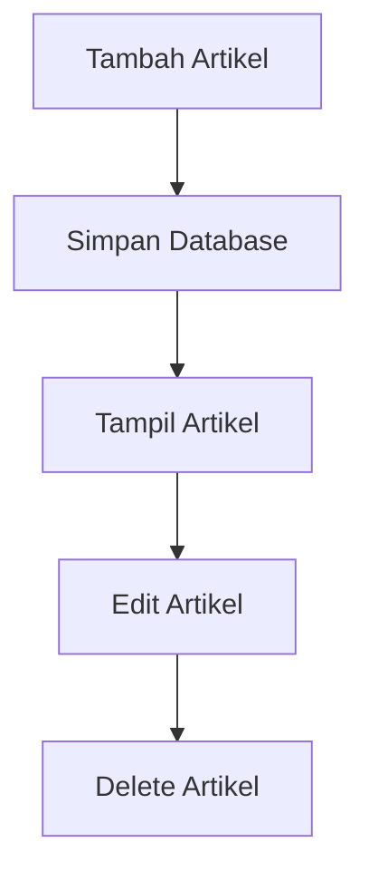

Fitur:
- Tambah artikel
- Edit artikel
- Hapus artikel
- Validasi form
- Slug otomatis

Screenshot:

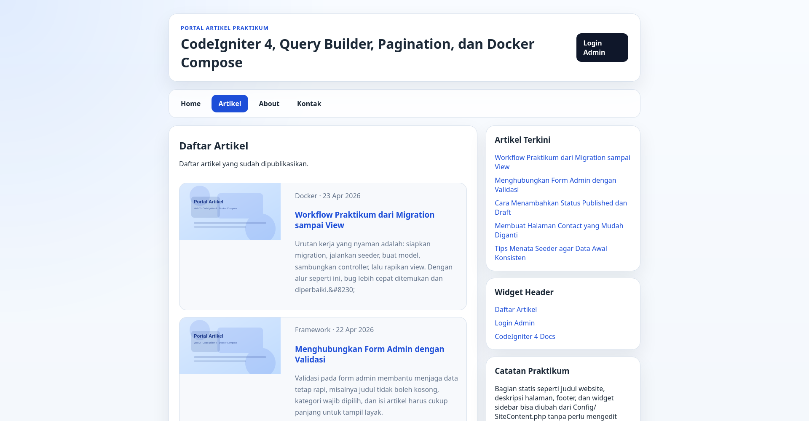

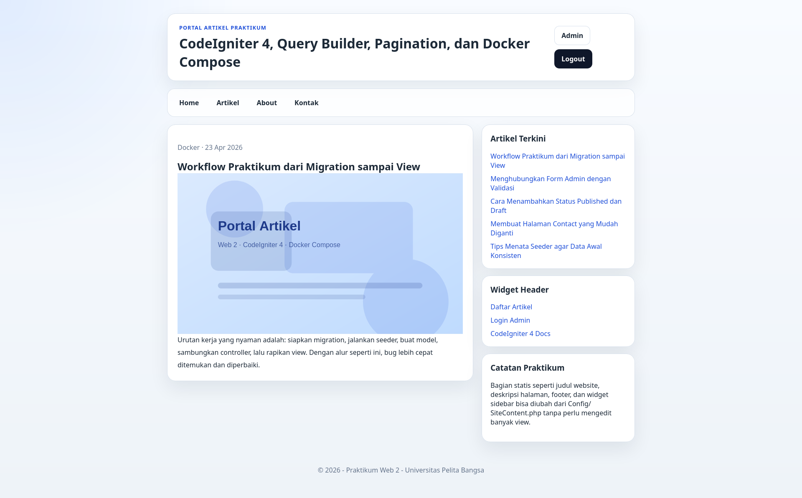

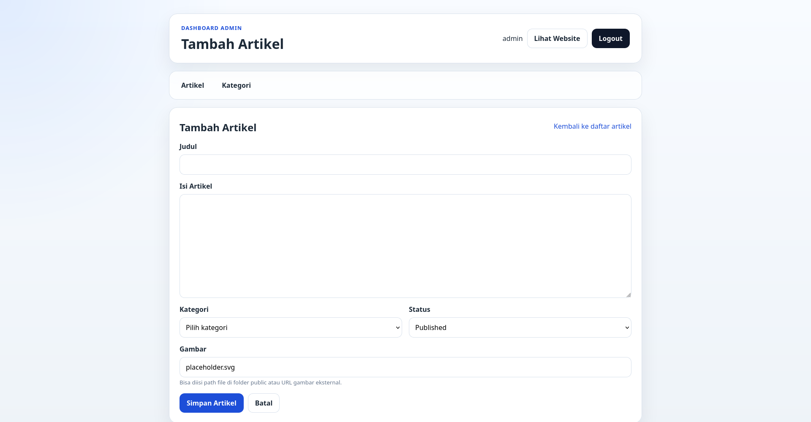

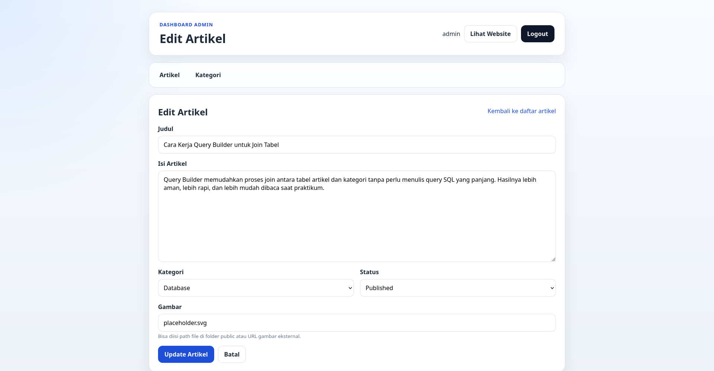

---

# 📘 Modul 3 — View Layout dan View Cell

Modul ketiga membahas template reusable.

Materi:
- Layout utama
- Header
- Footer
- Sidebar
- View Cell

Flow:

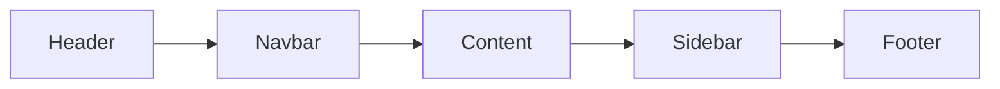

Implementasi:
- Template utama
- Sidebar dinamis
- Artikel terbaru

Screenshot:


---

# 📘 Modul 4 — Authentication dan Session

Modul keempat berfokus pada sistem login admin.

Materi:
- Login
- Session
- Middleware
- Logout

Flow:

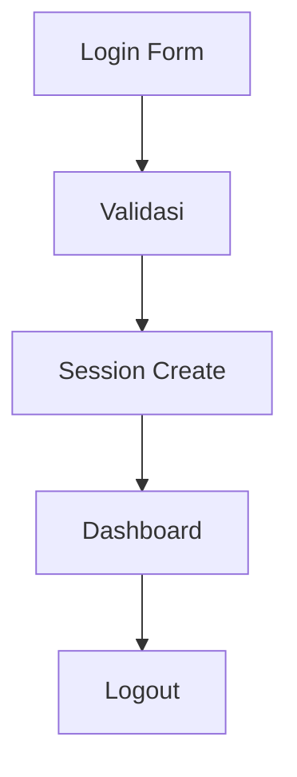

Fitur:
- Login admin
- Session management
- Auth filter
- Logout

Screenshot:

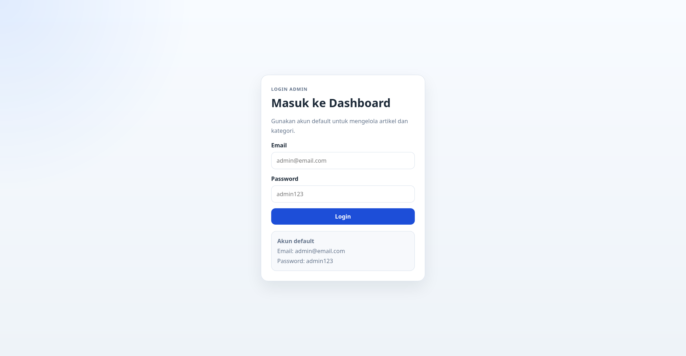

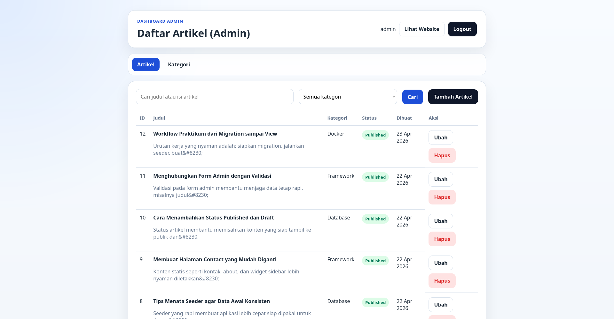

---

# 📘 Modul 5 — Pagination, Search, Filter

Modul kelima berfokus pada pengolahan data lebih lanjut.

Materi:
- Pagination
- Search
- Filter kategori

Flow:

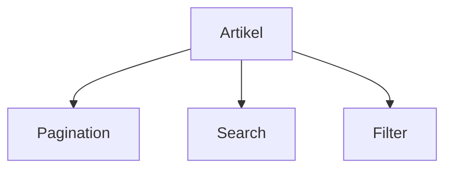

Implementasi:
- Pagination public
- Pagination admin
- Search judul
- Search isi
- Filter kategori

Screenshot:


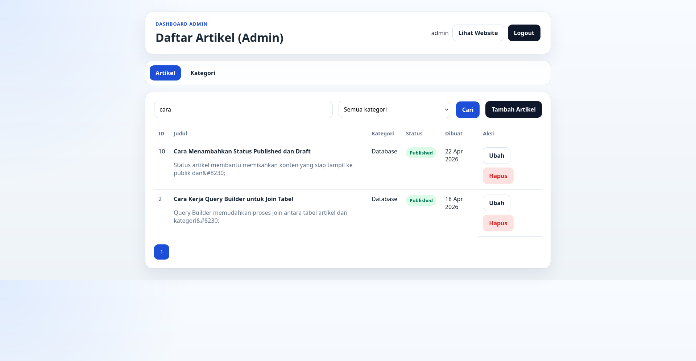

---

# 📘 Modul 6 — Relasi Tabel dan Query Builder

Modul keenam membahas relasi database.

Relasi:

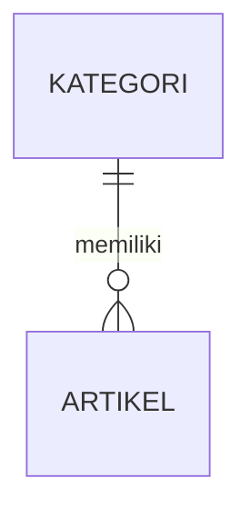

Materi:
- Foreign key
- Join query
- Query Builder
- CRUD kategori

Implementasi:
- Artikel memiliki kategori
- Kategori memiliki banyak artikel
- Validasi delete kategori

Screenshot:

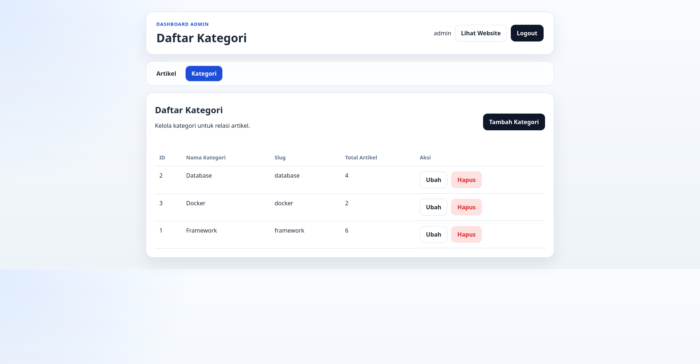

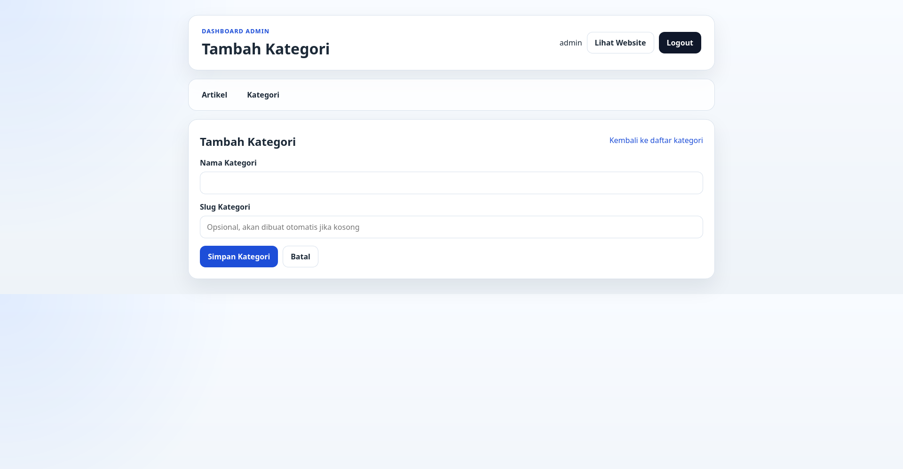

---

# 🌐 Endpoint Aplikasi

## Public Routes

| Method | Endpoint |
|--|--|
| GET | / |
| GET | /about |
| GET | /contact |
| GET | /artikel |
| GET | /artikel/{slug} |

---

## User Routes

| Method | Endpoint |
|--|--|
| GET/POST | /user/login |
| GET | /user/logout |

---

## Admin Routes

| Method | Endpoint |
|--|--|
| GET | /admin/artikel |
| GET/POST | /admin/artikel/add |
| GET/POST | /admin/artikel/edit/{id} |
| GET | /admin/artikel/delete/{id} |
| GET | /admin/kategori |
| GET/POST | /admin/kategori/add |
| GET/POST | /admin/kategori/edit/{id} |
| GET | /admin/kategori/delete/{id} |

---

# 🗄 Struktur Database

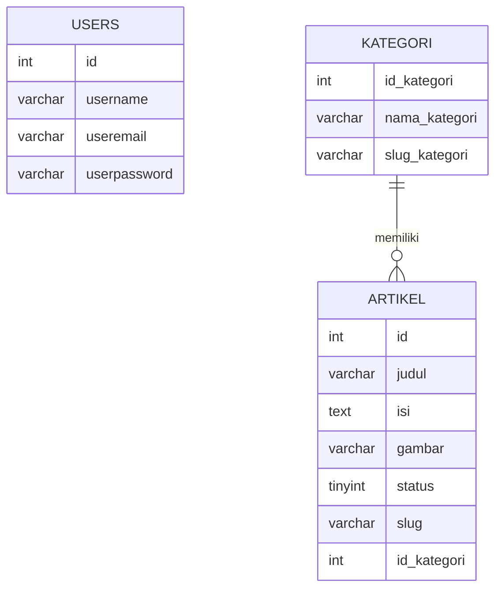

---

# 📁 Struktur Project

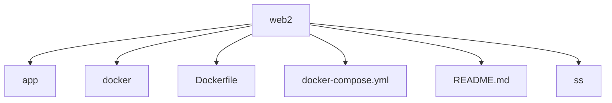

---

# 🔧 Development Commands

Masuk container:

```bash
docker exec -it web2_ci4_app bash
```

Migration:

```bash
php spark migrate
```

Seeder:

```bash
php spark db:seed
```

Logs:

```bash
docker compose logs app
```

---

# 📝 Catatan

- Password menggunakan hash
- Session tersimpan di writable/session
- Logs tersimpan di writable/logs
- Upload file tersimpan di writable/uploads
- Slug otomatis generate
- Delete kategori divalidasi

---

# 📄 Lisensi

Project ini dibuat untuk kebutuhan praktikum dan pembelajaran.
